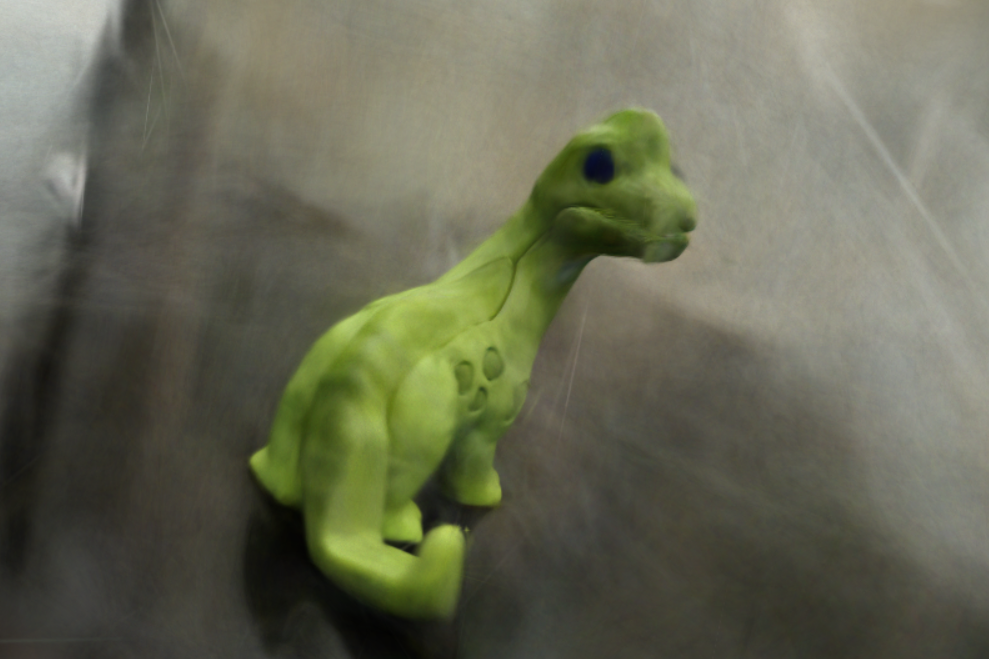
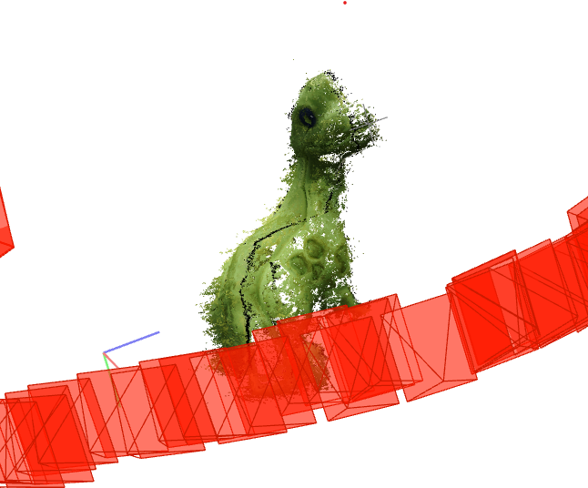
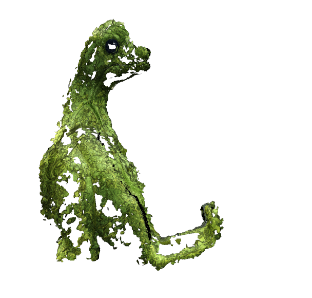

# 3D Reconstruction Pipeline: SfM → Segmentation → Gaussian Splatting

A hands-on implementation of a photogrammetric 3D reconstruction pipeline, built end-to-end on consumer hardware (NVIDIA GTX 1650 Ti, 4GB VRAM). Covers camera calibration, Structure-from-Motion, dense reconstruction, mesh generation, promptable segmentation (Segment Anything), and 3D Gaussian Splatting — with every stage debugged and validated against real captured data.



## Pipeline Overview

```
Camera Calibration → Feature Matching → COLMAP SfM (sparse) → COLMAP MVS (dense)
        → Open3D Cleaning/Meshing → SAM Segmentation → Masked Reconstruction
        → 3D Gaussian Splatting Training → Real-time Novel View Rendering
```

## What's in This Repo

| Phase | Area | Key Scripts |
|---|---|---|
| 1 | Camera calibration & feature matching | `calibrate_camera.py`, `feature_matching.py` |
| 2 | COLMAP sparse/dense reconstruction | (COLMAP GUI/CLI project files) |
| 3 | Point cloud cleaning & mesh reconstruction | `clean_pointcloud.py`, `mesh_reconstruction.py`, `check_scale.py` |
| 4 | PyTorch fundamentals | `phase4_pytorch/pytorch_basics.py` |
| 5 | Segment Anything (SAM) integration | `phase5_sam/segment_object.py`, `phase5_sam/batch_segment.py`, `phase5_sam/mask_undistorted_images.py` |
| 6 | 3D Gaussian Splatting | `gaussian-splatting/` (official repo, built from source) |

## Results

**COLMAP sparse reconstruction:**


**Mesh reconstruction from dense point cloud:**


**Final 3D Gaussian Splatting render** (see top of README) — trained for 30,000 iterations, final PSNR **37.94 dB**.

## Pipeline Walkthrough

### Phase 1 — Camera Calibration & Feature Matching
Calibrated a phone camera using a checkerboard pattern (OpenCV), achieving a final reprojection error of ~1.19 px after iterating on photo quality and coverage. Implemented SIFT feature detection, descriptor matching with Lowe's ratio test, and RANSAC-based geometric verification (Fundamental Matrix estimation) from scratch to understand what COLMAP does internally at scale.

### Phase 2 — Structure-from-Motion & Dense Reconstruction (COLMAP)
Captured multiple 360° orbit image sets of a small object. Iterated through several capture sessions to diagnose and fix registration failures — including background/lighting inconsistency, EXIF orientation issues, and matcher-type selection (Sequential vs. Exhaustive). Best unmasked result: **90/113 images registered** into a single connected reconstruction. Ran dense reconstruction (MVS/PatchMatch Stereo) to produce a ~180k-point dense cloud.

### Phase 3 — Point Cloud Cleaning & Meshing (Open3D)
Applied two-pass outlier removal (statistical + radius-based) to strip reflective-surface noise from the dense cloud. Built a normal-estimation + Poisson surface reconstruction pipeline, tuning parameters (search radius, Poisson depth) against the point cloud's actual measured scale rather than fixed defaults — since every fresh COLMAP reconstruction lands on an arbitrary coordinate scale.

### Phase 4 — PyTorch Fundamentals
Worked through tensors, autograd, `nn.Module`, and the core training loop. Diagnosed a real convergence issue caused by unnormalized input data (uneven gradient scaling between parameters) and fixed it via input standardization — a hands-on demonstration of why this is standard practice, not just textbook advice.

### Phase 5 — Segment Anything (SAM)
Built both interactive (click-to-segment) and batch segmentation tools using SAM (ViT-B). The batch tool auto-prompts with a center point per image, with automatic sanity-checking (mask area heuristics) to catch cases where the heuristic fails, falling back to an inline manual click-correction workflow.

**Key finding:** masking images before COLMAP feature extraction removes background noise but **reduces sparse registration robustness** — background keypoints, while irrelevant to the final model, act as "connective tissue" helping COLMAP link frames together, especially for low-texture objects. Since PatchMatch Stereo has no native mask support, built a workaround that masks the *undistorted* images directly before the dense stereo stage — preserving strong sparse registration (unmasked) while still eliminating background noise from the final dense point cloud.

### Phase 6 — 3D Gaussian Splatting
Built the official `graphdeco-inria/gaussian-splatting` repo from source on Windows, including compiling three custom CUDA extensions (`diff-gaussian-rasterization`, `simple-knn`, `fused-ssim`) against a CUDA/MSVC version mismatch (CUDA 12.1 vs. a newer MSVC toolchain than the compiler officially supports) — resolved via `-allow-unsupported-compiler` and `-D_ALLOW_COMPILER_AND_STL_VERSION_MISMATCH` compiler flags.

Trained on a 74-image masked COLMAP reconstruction. Diagnosed and fixed a mid-training VRAM-spillover slowdown (iteration time degraded ~24x due to exceeding 4GB VRAM during Gaussian densification) by tuning resolution downscaling (`-r 2`) and raising the densification gradient threshold. Final training: 30,000 iterations, **5 hours** on a 1650 Ti, final PSNR **37.94 dB**.

Also identified and documented a known 3DGS limitation firsthand: **floater artifacts** (elongated, streaky Gaussians) appear when rendering from viewpoints outside the training camera coverage — a direct consequence of incomplete capture coverage, not a training failure.

## Hardware & Environment

- **GPU:** NVIDIA GeForce GTX 1650 Ti (4GB VRAM)
- **OS:** Windows
- **Python:** 3.11 (separate venvs for main pipeline vs. Gaussian Splatting, due to CUDA/PyTorch version pinning)
- **Key libraries:** OpenCV, Open3D, PyTorch (cu121), segment-anything, COLMAP

## Key Engineering Challenges Solved

- Diagnosing COLMAP registration failures via feature-count and matching-log analysis
- Multi-pass point cloud outlier removal tuned to actual data scale
- CUDA/MSVC toolchain incompatibility resolution (three separate extension builds)
- Mid-training VRAM exhaustion diagnosis and mitigation
- Mask/registration tradeoff analysis and a working dense-stage-only masking pipeline

## Future Work (Phase 7)

Extending this pipeline to multi-object scenes: per-object SAM segmentation, masked reconstruction, and either joint or per-object Gaussian Splatting training — directly mirroring a production-style multi-object photogrammetry workflow.
